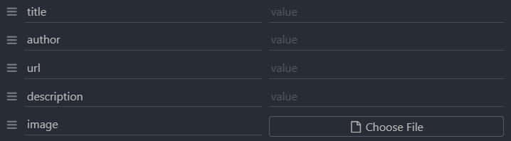

# NewsCards-backend

### Techs

- Node.js
- Express
- Knex.js
- MySQL

### Routes

`GET /newscards` Lista todos os cards <br>
`DELETE /newscards/:id` Deleta um card pelo id <br>
`POST /newscards` Adiciona um card <br>


### Starting

- Clone o repositório

```
git clone https://github.com/empixx/NewsCards-backend.git
```

- Instale as dependências

```
yarn
```

- Configure o .env de acordo com o .env.example

- Rode as migrations

```
npx knex migrate:latest
```

- Inicie

```
yarn dev
```
